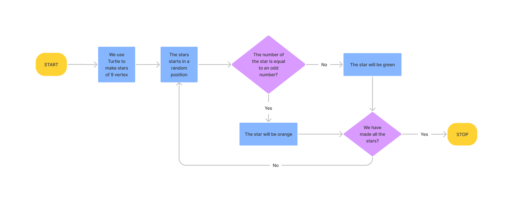

# Las-estrellas-regulares

Hemos hecho un proyecto que consiste en crear estrellas de nueve puntas. Mi dirección de GitHub es la siguiente:[GitHub](https://github.com/andmansim/Las-estrellas-regulares.git)

https://github.com/andmansim/Las-estrellas-regulares.git

El diagrama de flujo de las estrellas es el siguiente:


```
import random
from turtle import *

def stars(x1,y1):
    color('white') # color of the star 
    goto(x1,y1)
    color('green') # color of the star 
    if a in h: # color change
        color('orange')  
        for i in range(0,9):
            forward(100)
            left (160)
    else:
        for i in range(0,9):
            forward(100)
            left (160)
            
# X position
def movementx():
    x2 = float(random.randint(-200,200))
    if 0 < x2 < 100:
        x2 = x2 + 110 
    return x2

# Y position
def movementy():
    y2 = float(random.randint(-200,200))
    if 0 < y2 < 100:
        y2 = y2 + 110 
    return y2

x = 0.00
y = 0.00
h = [1, 3]
a = 0

# Painting 5 stars
while a != 5:
    stars(x,y)
    x = movementx()
    y = movementy()
    a = a + 1
    
done()  # finished
```
